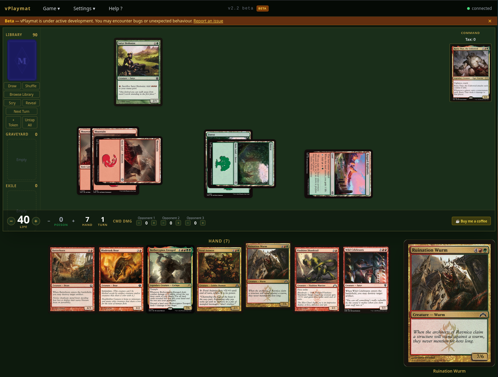
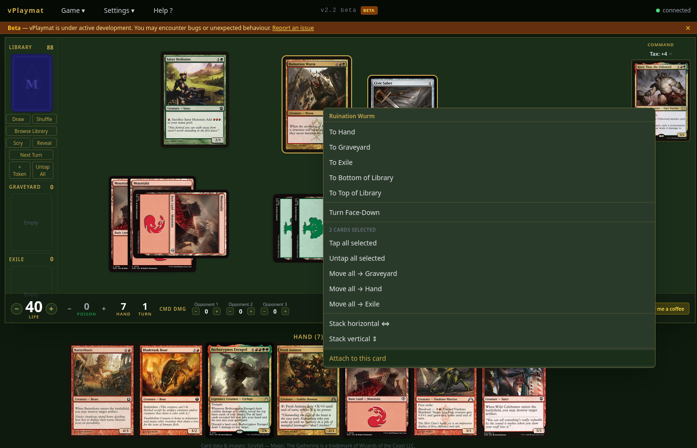
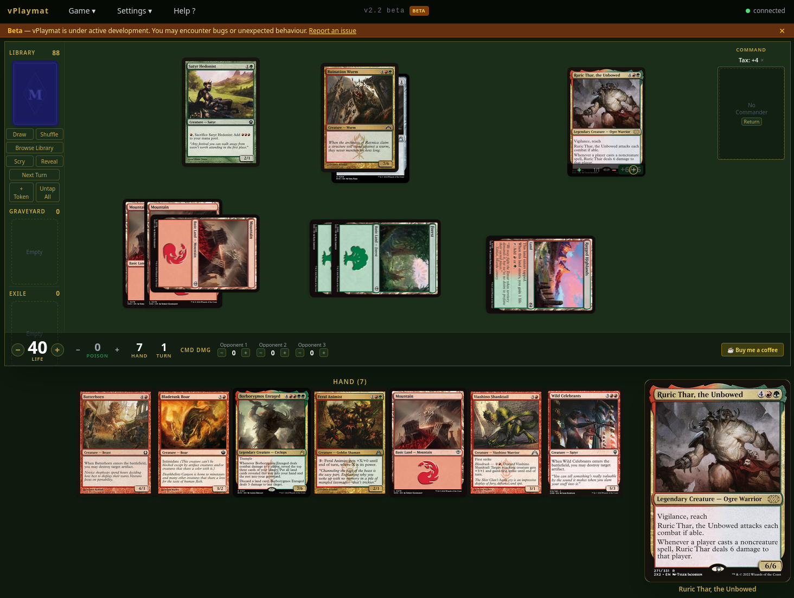
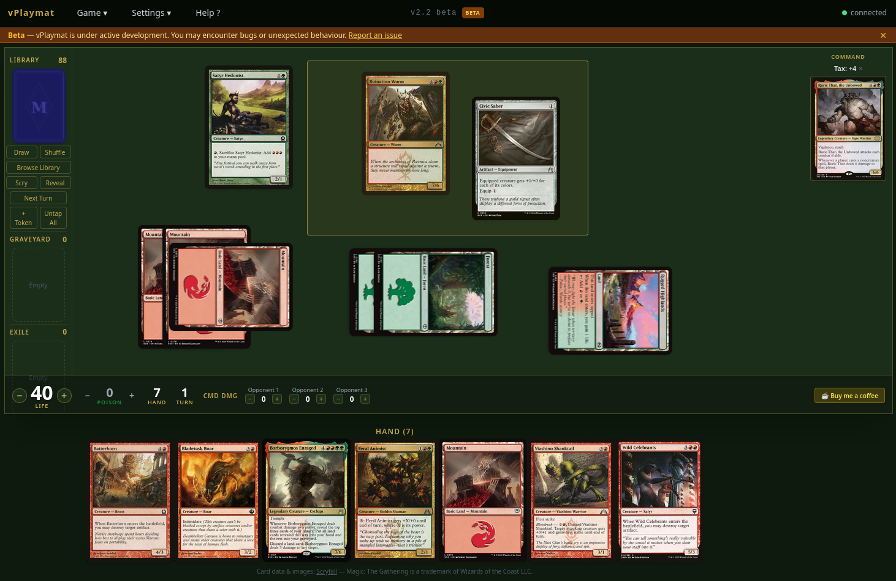
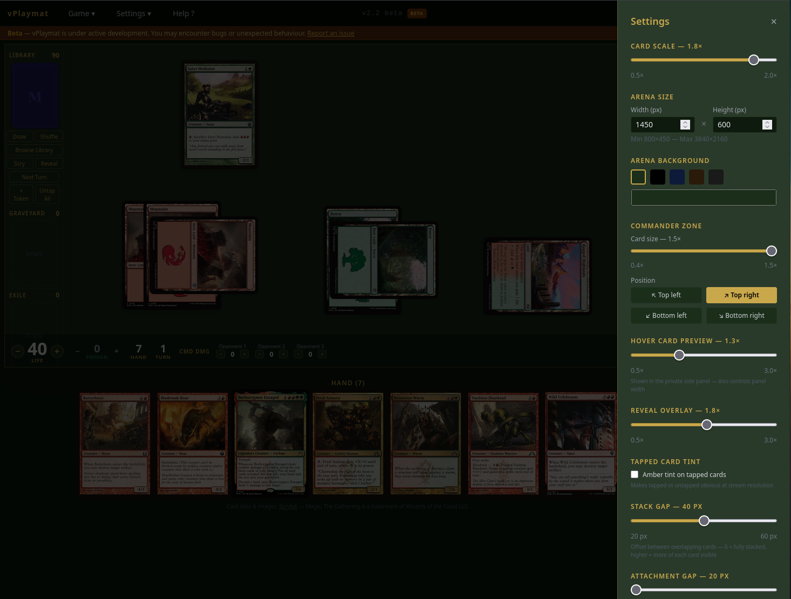

# vPlaymat — MTG Virtual Playmat

A Magic: The Gathering virtual playmat for personal use during online play (Spelltable, Discord, etc.). Stream it via OBS Browser Source instead of a physical webcam — your opponent sees a clean digital board while you control everything privately.

> Built with [Claude Code](https://claude.ai/claude-code) — AI-assisted vibe coding.

---

## Screenshots










---

## Features

### Gameplay
- **Deck import** — paste any MTGA-format decklist; cards load instantly via Scryfall
- **Zones** — Library, Hand, Battlefield, Graveyard, Exile, Command Zone
- **Drag & drop** — play cards from hand to battlefield with free positioning
- **Tap / Untap** — click to tap; optional amber tint for tapped cards
- **Right-click context menu** — move any card to any zone instantly
- **Face-down cards** — Morph / Manifest support; right-click to flip face-up
- **Double-faced cards** — right-click to transform between front and back faces
- **Library browser** — browse your full library privately below the arena
- **Scry** — view and reorder the top N cards privately
- **Reveal** — show the top N cards inside the arena (OBS-visible)
- **Token creator** — search Scryfall for token art or create custom tokens
- **Counters** — +1/+1, -1/-1, loyalty, charge, and custom counters with colour-coded badges
- **Graveyard ordering** — newest card always on top, correct ordering in zone viewer

### Multi-select & stacking
- **Shift+click** — select multiple battlefield cards (gold ring indicator)
- **Rubber band selection** — click and drag on empty space to draw a selection rectangle
- **Group drag** — drag any selected card to move the whole group, preserving relative positions and z-order
- **Stack horizontal / vertical** — arrange selected cards in an overlapping pile (configurable gap)
- **Attach to this card** — right-click the host creature; equipment/auras fan out diagonally behind it
- **Z-order control** — most recently moved card is always on top; stacking and attaching set order explicitly

### Tracking
- **Life counter** — click +/− to adjust; supports large life totals
- **Poison counters** — tracked separately
- **Turn counter** — Next Turn button advances turn, untaps all, draws a card
- **Game log** — private action log with turn numbers; lives below the arena

### Commander support
- Dedicated command zone with drag-to-battlefield
- Commander damage tracking per opponent (21-damage loss alert)
- **Commander return counter** — tracks how many times your commander returned to the command zone (shows current tax cost); resets with one click
- Commander card scale and positioning options

### Stream / OBS
- Fixed-size arena — set width & height in Settings to match your OBS scene
- Everything below the arena is private (not captured by OBS)
- Card hover preview lives outside the arena in a dedicated column
- Arena background colour is configurable

### Session management
- Session persists across tab close/reopen (same browser)
- Incognito window = fresh session
- Game state cached to localStorage — survives backend restarts
- Auto-reconnect banner on WebSocket drop

### Settings
- Arena size (width × height)
- Card scale, card preview scale
- Commander card scale and zone position
- Zone viewer card scale, library browser height
- Reveal overlay card scale
- Counter badge scale
- Stack gap (offset between stacked cards, 20–60 px)
- Attachment gap (diagonal offset for attached cards, 20–60 px)
- Tapped card amber tint toggle
- Arena and page background colours

---

## Quick start — Podman / Docker

One command builds and starts everything in a single container (nginx + uvicorn via supervisord):

```bash
# Clone the repo
git clone https://github.com/your-username/vPlaymat.git
cd vPlaymat

# Podman
python -m venv backend/.venv
source backend/.venv/bin/activate
pip install podman-compose
podman-compose -f docker-compose.prod.yml up --build

# Docker Compose
docker compose -f docker-compose.prod.yml up --build
```

Open **http://localhost:8080** in your browser.

### Streaming with OBS

You play vPlaymat in your browser as normal. OBS captures a clean view of the arena and sends it to your opponents via a virtual camera in Spelltable, Discord, or any other platform.

There are two capture methods — pick whichever suits you.

---

#### Method 1 — OBS Browser Source (recommended)

vPlaymat has a built-in clean OBS view: no menu bar, no hand zone, nothing private. It connects to your active game session and updates live.

**Setup (one time):**

1. Open vPlaymat in your browser and import your deck — this is where you play
2. Open the **Game** menu and click **Copy OBS URL**
3. In OBS, click **+** in the Sources panel and choose **Browser**
4. Paste the copied URL as the URL
5. Set **Width** and **Height** to match your arena size in Settings (default **1280 × 720**)
   > ⚠️ This must exactly match your arena size — if it is off the battlefield will be cropped or have black bars
6. Click OK

**If you see a black bar under the battlefield:**
Your OBS scene canvas is larger than your browser source. Fix with one of these:
- OBS → Settings → Video → set Base (Canvas) Resolution to **1280 × 720**
- Or right-click the source → **Transform → Fit to screen** to scale it up to fill your canvas

**Sending to Spelltable / Discord:**

7. In OBS click **Start Virtual Camera**
8. In Spelltable or Discord, select **OBS Virtual Camera** as your camera

---

#### Method 2 — Screen capture

If you prefer not to use the Browser Source, you can capture your browser window directly.

1. In OBS, click **+** in Sources and choose **Window Capture** (or **Display Capture**)
2. Select the browser window running vPlaymat
3. Add a **Crop/Pad** filter (right-click source → Filters) to crop to just the arena area — everything below the arena border is private and should be cropped out
4. Enable **OBS Virtual Camera** and select it in Spelltable / Discord

**What to be aware of with screen capture:**
- If you resize your browser window the crop will be off and needs to be re-adjusted
- Your browser window must not be hidden behind other windows during play
- The arena includes the menu bar at the top — crop that out too if you want a clean look

---

#### General tips

- The **arena size** in vPlaymat Settings (default 1280 × 720) should match your OBS canvas and your stream output resolution for the cleanest result
- Everything **below the arena** (hand, card preview, buttons) is never visible in either capture method — it stays private
- If you change your arena size in Settings, update the Browser Source dimensions in OBS to match

---

## Local development

### Prerequisites

- Python 3.11+
- Node 20 (use [nvm](https://github.com/nvm-sh/nvm))
- Podman or Docker (for production builds only)

### Backend

```bash
cd backend
python -m venv .venv
source .venv/bin/activate
pip install -r requirements.txt
uvicorn main:app --reload
# API runs on http://localhost:8000
# Interactive docs: http://localhost:8000/docs
```

### Frontend

```bash
cd frontend
nvm use        # picks up .nvmrc (Node 20)
npm install
npm run dev
# App runs on http://localhost:5173
```

### Run both with Podman (dev)

```bash
source backend/.venv/bin/activate
podman-compose up
```

- Frontend: http://localhost:5173
- Backend: http://localhost:8000

---

## Running tests

### Backend

```bash
cd backend
source .venv/bin/activate
pytest -v
```

### Frontend

```bash
cd frontend
npm test -- --run
```

---

## Environment variables

| Variable | Where | Default | Description |
|----------|-------|---------|-------------|
| `ALLOWED_ORIGINS` | backend | `http://localhost:5173` | Comma-separated list of allowed CORS origins |
| `PUBLIC_URL` | backend | _(empty)_ | Shown in startup log — set to your public URL |
| `VITE_API_BASE` | frontend build | `http://localhost:8000` | Backend REST base URL |
| `VITE_WS_URL` | frontend build | `ws://localhost:8000/ws` | Backend WebSocket URL |

In production (`docker-compose.prod.yml`), nginx proxies all API calls on the same origin so `VITE_API_BASE` and `VITE_WS_URL` are left empty and the frontend uses relative paths.

---

## Self-hosting on Render.com

Render.com offers free-tier hosting. vPlaymat deploys as a **single Docker container** — no separate services needed.

See [`render.yaml`](render.yaml) for a one-click Blueprint, or follow the manual steps:

1. **New Web Service** → connect your GitHub fork → **Docker** runtime
2. Dockerfile path: `Dockerfile.prod`, Docker context: `.` (repo root)
3. After the first deploy, copy your service URL (e.g. `https://vplaymat.onrender.com`)
4. Set env vars in the Render dashboard:
   - `ALLOWED_ORIGINS=https://vplaymat.onrender.com`
   - `PUBLIC_URL=https://vplaymat.onrender.com`
5. Trigger a redeploy

> **Free tier note:** Render spins down idle services after 15 minutes. The backend may take ~30 seconds to wake up. The reconnect banner will show while it wakes — your cached game state restores automatically.

---

## Tech stack

| Layer | Technology |
|-------|-----------|
| Frontend | React 18, TypeScript, Tailwind CSS, Vite |
| Backend | Python 3.11+, FastAPI, httpx, uvicorn |
| Testing (FE) | Vitest, React Testing Library |
| Testing (BE) | pytest, pytest-asyncio, respx |
| Container | Podman / Docker + Compose |
| Reverse proxy | nginx |
| Card data | [Scryfall API](https://scryfall.com/docs/api) |

---

## Support

vPlaymat is free and will always be free. If you enjoy it and want to say thanks, a coffee is always appreciated:

[](https://buymeacoffee.com/jkielsgaard)

---

## Legal & attribution

vPlaymat is a personal, non-commercial tool for use during online Magic: The Gathering games.
It is not affiliated with, endorsed by, or connected to Wizards of the Coast.

Magic: The Gathering, its card names, and all related IP are trademarks of **Wizards of the Coast LLC**.
Card images and data are provided by **[Scryfall](https://scryfall.com)** under their [API terms](https://scryfall.com/docs/api).
This application is non-commercial and makes no claim of ownership over any card artwork.

By using vPlaymat you confirm you own or have the right to use the cards you import, and that
you will use the application only for personal, non-commercial play.

---

## Contributing

See [CONTRIBUTING.md](CONTRIBUTING.md) for how to set up a dev environment and submit changes.

---

## License

[MIT](LICENSE)
